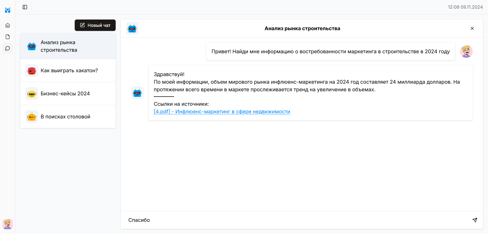

<p align="center">
   <h1 align="center">🤖 Frontend Чат-бота для помощи сотрудникам</h1>
   <h3 align="center">
      Команда  представляет решение кейса "Поиск по базе знаний"
   </h3>
</p>

Современный web-интерфейс чат-бота для поиска по базе знаний компании MediaWise



## Ключевые особенности

> [!Note]
> Исходя из собственного опыта, работа с помощником в виде интерфейса чата - самый удобный и привычный способ общения для сотрудников

- Поддерживаются несколько чатов с помощником
- Каждое сообщение сопровождается ссылкой на источник информации
- Возможность загрузить дополнительные файлы прямо из панели
- Стриминг сообщений - помощник начинает отвечать уже спустя несколько секунд

## Стэк технологий

- `React`
- `NextJS`
- `TailwindCSS`
- `shadcn/ui`
- `TypeScript`

## Развертывание

### Docker

Приложение поддерживает развертывание с использованием Docker Compose.

### Ручное развертывание

1. Установить необходимые библиотеки

   ```bash
   npm ci
   ```

2. Определить переменные среды (см. .env)
3. Запустить проект

   ```bash
   npm run start
   ```

Приложение будет доступно на порту 3000.

### Переменные среды

- `NEXT_PUBLIC_SELF_URL` - ссылка на публичный адрес этого сайта
- `NEXT_PUBLIC_API_URL` - ссылка на API сервер
